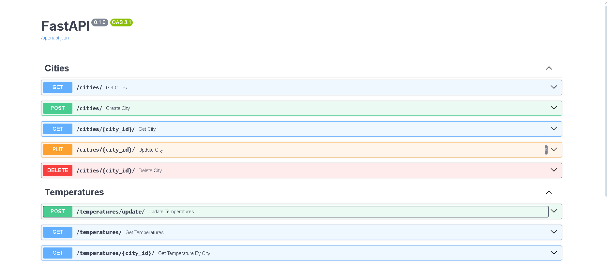

## Temperature Management API

This FastAPI application manages city data and their corresponding temperature data. It consists of two main components:
1. City CRUD API: Manages city data including creation, retrieval, updating, and deletion of city records.
2. Temperature API: Fetches current temperature data for cities and stores it in the database. Provides endpoints to retrieve temperature records.

### Endpoints

* City:
    - `POST /cities`: Create a new city.
    - `GET /cities`: Get a list of all cities.
    - `GET /cities/{city_id}`: Get the details of a specific city.
    - `PUT /cities/{city_id}`: Update the details of a specific city.
    - `DELETE /cities/{city_id}`: Delete a specific city.

* Temperature

   - `POST /temperatures/update` Fetch current temperature for all cities and store in the Temperature table asynchronously.
   - `GET /temperatures`: Get a list of all temperature records.
   - `GET /temperatures/?city_id={city_id}`: Get the temperature records for a specific city.

### Quick start:
1. Clone the repository
```shell
git clone https://github.com/Anna728560/py-fastapi-city-temperature-management-api.git
```
2. Set up a virtual environment:
```shell
python -m venv venv
source venv/bin/activate # or venv\Scripts\activate in Windows
```
3. Install dependencies:
```shell
pip install -r requirements.txt
```
4. Perform database migrations using Alembic:
```shell
alembic revision --autogenerate -m "Initial migration"
alembic upgrade head
```
5. Run the server:
```shell
uvicorn main:app --reload
```

### Built With:

* Python - Backend programming language
* FastAPI - Web framework for building APIs with Python
* SQLAlchemy - SQL toolkit and Object-Relational Mapping (ORM) for Python
* Alembic - Database migrations framework for Python's SQLAlchemy

### Documentation

